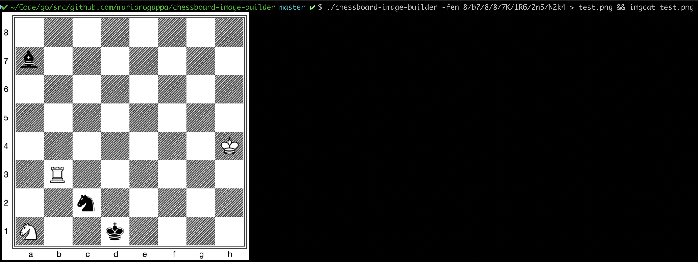

# chessboard-image-builder

## Install

```
go get github.com/marianogappa/chessboard-image-builder
```

## Usage



You can change the piece and background images, but then you'll need to reconfigure these variables:

```
// Set these parameters manually while running with -debug flag to match the grid
boardMinX  = 40
boardMinY  = 15
boardMaxX  = 783
boardMaxY  = 760
cellWidth  = 93
cellHeight = 93
```

This is not exactly a general-purpose tool; I wrote it to quickly regenerate all starting board images for a project I'm working on. If it's useful for you and you need a hand adapting it to your use case, let me know. Check the bash script for an example of batch producing images.
